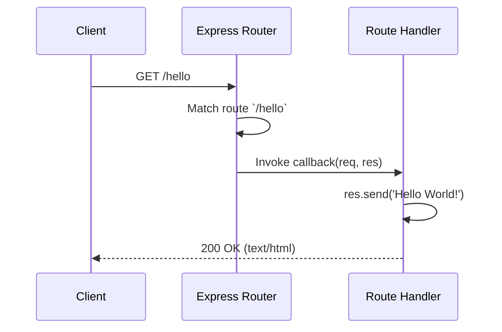

# Mini Server

A minimal Express server with a single `GET /hello` endpoint.

## Request Flow

```mermaid
sequenceDiagram
    participant Client
    participant Express as Express Router
    participant Handler as Route Handler

    Client->>Express: GET /hello
    Express->>Express: Match route `/hello`
    Express->>Handler: Invoke callback(req, res)
    Handler->>Handler: res.send('Hello World!')
    Handler-->>Client: 200 OK (text/html)
```
