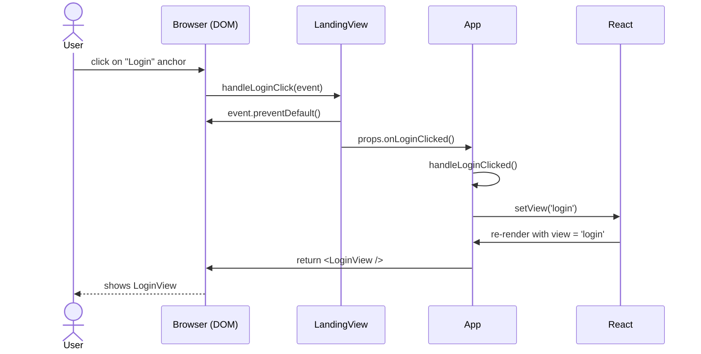

# App

## Login click flow: from `LandingView` to view change in `App`

```mermaid
sequenceDiagram
    actor User
    participant Browser as Browser (DOM)
    participant Landing as LandingView
    participant App as App
    participant React as React

    User->>Browser: click on "Login" anchor
    Browser->>Landing: handleLoginClick(event)
    Landing->>Browser: event.preventDefault()
    Landing->>App: props.onLoginClicked()
    App->>App: handleLoginClicked()
    App->>React: setView('login')
    React->>App: re-render with view = 'login'
    App->>Browser: return <LoginView />
    Browser-->>User: shows LoginView
```
